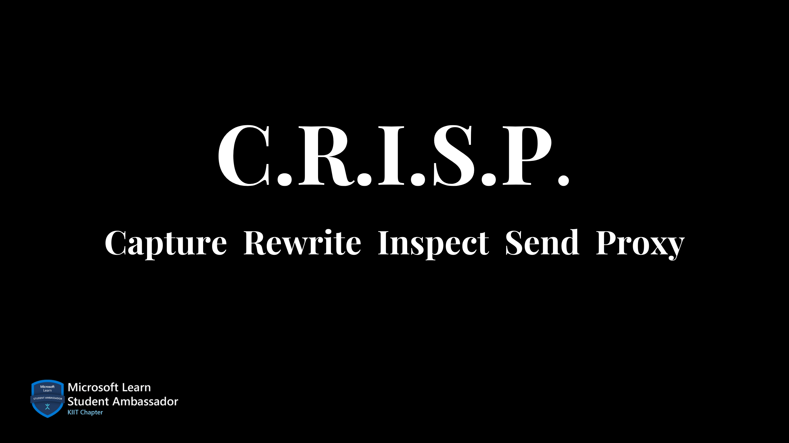

<h1 align="center" > C.R.I.S.P. </h1> 

 (Capture, Rewrite, Inspect, Send, Proxy)

C.R.I.S.P. is a Python-based web proxy tool, designed to intercept, modify, and forward HTTP/HTTPS traffic. 

  <a href="#features"><strong>Features</strong></a> ·
  <a href="#architecture"><strong>Architecture</strong></a> ·
  <a href="#tech-stack"><strong>Tech Stack</strong></a> ·
  <a href="#dependencies"><strong>Dependencies</strong></a> ·
  <a href="#license"><strong>License</strong></a> ·
  <a href="#acknowledgments"><strong>Acknowledgments</strong></a>

## Features

### 1. **Capturing requests**
- Intercept and log HTTP/HTTPS requests and responses from the browser.

### 2. **Modify requests**
- Modify requests and responses before forwarding them to the server or client.

### 3. **HTTP history**
- View the history of captured requests and responses.

## Architecture

### Proxy Server
- The proxy server acts as the core component to intercept HTTP/HTTPS traffic. 
- A listener socket captures client requests and forwards them to the destination server.

### SSL/TLS Support
- The proxy server supports SSL/TLS connections for HTTP traffic.
- Download the CA certificate and install it in the browser to intercept HTTPS traffic.

### Setting Up API Endpoints
- The API endpoints allow your UI or CLI to interact with the intercepted traffic.(Flask or FastAPI)

### UI Layer
- The UI layer provides a user-friendly interface to view and modify the intercepted traffic.

### Database Layer
- storing http history and logs

## Tech Stack

## Dependencies

The following Python libraries are required to run the project:

- Flask or FastAPI (for UI and API handling)
- pyOpenSSL (for SSL/TLS support)
- socket, ssl, urllib.parse (for proxy server functionality)
- threading (for concurrent operations)
- logging (for logging requests and responses)
- ssl (for SSL/TLS certificate generation)

This project is licensed under the MIT License - see the LICENSE file for details.

<!-- This README template is a starting point for your project.>
This README outlines the features, architecture, and file structure for the project. You can customize it further based on specific implementation details or preferences. -->

